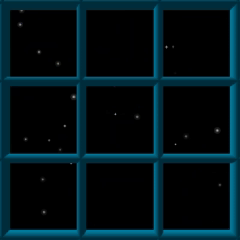

# TicTacToeJS

Who doesn't know the game of Tic-tac-toe? This time you are floating in space and need to play the game to survive. Enjoy this simple but interesting game while being treated with awesome visual effects. **Click the image to play the game.**

This fully front-end based application is a port of my C# TicTacToe implementation [2], but with added visuals. All the code is written in JavaScript (besides some basic *html* and *css*) and the visualization is done using the *p5.js* library [3]. To allow for simulating 3D environments the rendering is done using WEBGL. 

The frame, crosses and circles are rendered in 3D, reflect lighting coming from the mouse's position and are animated when the game ends. The stars in the background are rendered with smart use of multiple 2D layers, transparency and some randomization. Unfortunately, drawing the many stars in the 3D space can cause some framerate issues due to the slow nature of the software language.

The computationally expensive algorithms are run using Web Workers [4], to ensure optimal responsiveness of the GUI. Web Workers are a simple means for web content to run scripts in background threads. 

The application supportes 3 types of players; the `human player` allows the user to click one of the empty squares to play a move, the `random player` plays, like the name implies, a random valid move every time, while the `MCTS player` uses the Monte Carlo Tree Search algorithm described in [5]. Since the game of Tic-tac-toe can be solved quite easily and the outcome is always a draw when playing optimal, is it impossible to win against the MCTS player. Good luck trying!

## Sources

1. https://en.wikipedia.org/wiki/Tic-tac-toe
2. https://github.com/colinschepers/TicTacToe-CSharp
3. https://p5js.org/
4. https://www.w3schools.com/html/html5_webworkers.asp
5. https://en.wikipedia.org/wiki/Monte_Carlo_tree_search
